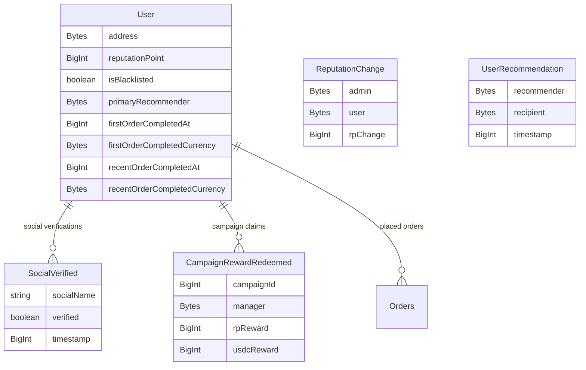
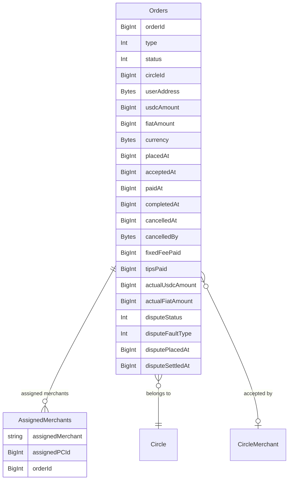
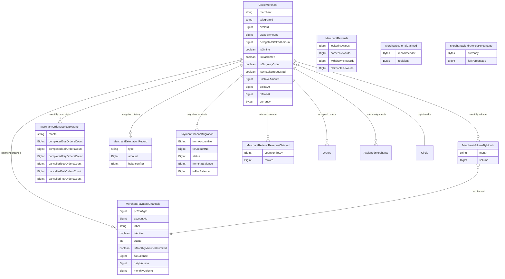

# Event Indexer

A [Graph Protocol](https://thegraph.com/studio/) subgraph that indexes smart contract events from a peer-to-peer marketplace deployed on **Base** and **Base Sepolia**. Built with AssemblyScript, compiled to WebAssembly, and served as a GraphQL API.

The marketplace operates around **Circles** (communities) where merchants register, users place orders (BUY/SELL/PAY), stake USDC, earn rewards, and build reputation.

---

## Prerequisites

- **Node.js** >= 18
- **npm** >= 9
- **Docker** & **Docker Compose** (for local graph-node)
- **Graph CLI** (installed as project dependency)

---

## Setup

### 1. Install dependencies

```bash
npm install
```

### 2. Generate types from ABIs and schema

```bash
npm run codegen
```

> Run this every time you modify `schema.graphql` or any ABI file in `abis/`.

### 3. Build the subgraph

```bash
npm run build
```

### 4. Local deployment (optional)

Start the local graph-node stack (graph-node, IPFS, PostgreSQL):

```bash
docker-compose up -d
```

Create and deploy the subgraph locally:

```bash
npm run create-local
npm run deploy-local
```

Once running, the GraphQL playground is available at `http://localhost:8000`.

### 5. Studio deployment

```bash
npm run deploy
```

Deploys to The Graph Studio at `https://thegraph.com/studio/`.

---

## Network Configuration

Contract addresses per network are defined in `networks.json`:

| Network | Diamond Proxy | ReputationManager |
|---------|--------------|-------------------|
| `base` | `0x4cad6eC90e65baBec9335cAd728DDC610c316368` | `0xCF613e08EE1B4c2669DdCf06A7d22c9856f6Aa1D` |

All data sources (except ReputationManager) point to the same diamond proxy contract.

---

## Entity Relationship Diagram

### User Entities



### Order Entities



### Merchant Entities



---

## Available Scripts

| Command | Description |
|---------|-------------|
| `npm run codegen` | Generate TypeScript types from ABIs and schema |
| `npm run build` | Compile AssemblyScript to WebAssembly |
| `npm run deploy` | Deploy to The Graph Studio |

---

## Circle Score & Order Routing

The event-indexer computes and stores a **trust-weighted score** (0–100) for each circle based on its performance. Circle selection happens client-side — this repo only handles score computation.

### Circle Lifecycle

Every circle goes through these statuses:

```
                    ┌─────────────┐
         Created───►│  bootstrap   │
                    └──────┬──────┘
                           │
              ┌────────────┼────────────┐
              ▼            │            ▼
     ┌────────────┐        │     ┌────────────┐
     │   active    │◄───────┘     │  rejected   │
     └─────┬──────┘              └────────────┘
           │                           ▲
           ▼                           │
     ┌────────────┐                    │
     │   paused    │────────────────────┘
     └─────┬──────┘
           │
           ▼
     ┌────────────┐
     │   active    │  (recovers when settlement improves)
     └────────────┘
```

- **bootstrap** — New circle. Starts with `score = 50`. Receives orders to prove itself.
- **active** — Graduated circle. Fully participates in order routing.
- **paused** — Settlement too slow (>600s avg). Gets fewer orders but can recover.
- **rejected** — Permanently blocked. Never receives orders again.

### Step 1: Trust Firewall (runs first on every score update)

Before anything else, the system checks circle status:

```
if status == rejected  →  skip scoring entirely (score stays 0)
if avg_settlement > 600s  →  status = paused              (reduced orders)
```

- **Rejected** circles are permanently removed from order routing. Rejection is handled **on-chain** via `CircleStatusUpdated` event — the contract uses `disputeCounter >= disputeThreshold` (from `SlashConfig`). The indexer simply receives the event and sets `score = 0`.
- **Paused** circles still get a chance at orders, giving them an opportunity to improve settlement times and return to active.
- If a paused circle brings its avg settlement back to ≤600s, it automatically becomes **active** again (or **bootstrap** if it hasn't graduated yet).

### Step 2: Bootstrap Phase (new circles)

When a circle is first created, it enters **bootstrap** with a default score of 50. This gives new circles a fair chance to receive orders and build a track record.

**Graduation to active** happens when either threshold is met:

| Threshold | Value |
|-----------|-------|
| Lifetime orders | ≥ 40 |
| Lifetime USDC volume | ≥ 20,000 USDC |

**Weight cap** — Bootstrap circles have their score capped at 25 (`BOOTSTRAP_MAX_WEIGHT`), regardless of the calculated score. This prevents unproven circles from dominating order routing.

**Rejection** — There is no bootstrap-specific rejection logic. Rejection is always handled on-chain via `disputeCounter >= disputeThreshold`, with no bootstrap distinction. The indexer receives the `CircleStatusUpdated` event and sets `score = 0`.

### Step 3: Circle Score Calculation (0–100)

The score is only computed when:
- Circle is **not rejected**
- Circle has completed at least **10 orders** (MIN_ORDERS_FOR_SCORE)

The score is a weighted combination of 4 sub-scores, each ranging from 0 to 100:

```
score = 0.35 × speed + 0.30 × dispute + 0.20 × merchants + 0.15 × volume
```

#### 3a. Speed Score (35% weight)

Measures how fast merchants settle orders (time from paid to completed, for SELL/PAY orders). Calculated over a **rolling 30-day window**.

```
speed = clamp(100 × (150 - avg_settlement_seconds) / (150 - 45), 0, 100)
```

- 45 seconds = best case (score 100)
- 150 seconds = worst case (score 0)

| Avg Settlement | Speed Score |
|---------------|-------------|
| 45s | 100 |
| 60s | ~86 |
| 75s | ~71 |
| 90s | ~57 |
| 120s | ~29 |
| 150s+ | 0 |

#### 3b. Dispute Score (30% weight)

Penalizes circles with high dispute rates. Lower disputes = higher score.

```
dispute = max(0, 100 - (dispute_rate × 1800))
```

| Dispute % | Score |
|-----------|-------|
| 0.0% | 100 |
| 0.5% | 91 |
| 1.0% | 82 |
| 2.0% | 64 |
| 3.0% | 46 |
| 5.0% | 10 |
| ≥5.6% | 0 |

#### 3c. Merchants Score (20% weight)

Rewards circles with more active merchants. A merchant is "active" when: `stakedAmount > 0 AND isOnline AND !isBlacklisted`.

```
merchants = min(100, active_merchants)
```

Simply counts active merchants, capped at 100.

#### 3d. Volume Score (15% weight)

Rewards circles with higher 30-day USDC trading volume.

```
volume = min(100, total_volume_usdc / 10,000)
```

| Total Volume (USDC) | Volume Score |
|--------------------|-------------|
| 0 | 0 |
| 50,000 | 5 |
| 100,000 | 10 |
| 250,000 | 25 |
| 500,000 | 50 |
| ≥1,000,000 | 100 |

### Note: Order Routing

Order routing (epsilon-greedy circle selection) does **not** live in this repo. The event-indexer only computes and stores the circle score. Circle selection happens client-side.

### 30-Day Rolling Window

All metrics (settlement time, dispute rate, volume) are computed over a **rolling 30-day window** using daily buckets (`CircleDailyMetrics` entity).

- Each day's data is stored in a separate bucket (keyed by `circleId-dayNumber`)
- On every order completion, the system scans the last 30 daily buckets and sums up the metrics
- This means a bad week 5 weeks ago no longer affects the score — circles can recover by performing well recently

### When is the score recalculated?

The circle score is recomputed on every **order completion** event. This keeps scores up-to-date as new performance data comes in.

### Example: Two Circles Compared

Let's walk through two circles with different performance profiles to see how the scoring works end-to-end.

#### Raw Metrics

| Metric | Circle Alpha | Circle Beta |
|--------|-------------|------------|
| Avg Settlement Time | 60s | 120s |
| Dispute Rate | 1.0% | 4.0% |
| Active Merchants | 25 | 8 |
| 30d Volume (USDC) | 500,000 | 50,000 |
| Lifetime Orders | 200 | 15 |
| Status | active | bootstrap |

#### Sub-Score Breakdown

**Circle Alpha:**
```
speed    = clamp(100 × (150 - 60) / (150 - 45), 0, 100)  = 85.7  ≈ 86
dispute  = max(0, 100 - (0.01 × 1800))                    = 82
merchants = min(100, 25)                                    = 25
volume   = min(100, 500,000 / 10,000)                      = 50
```

**Circle Beta:**
```
speed    = clamp(100 × (150 - 120) / (150 - 45), 0, 100)  = 28.6  ≈ 29
dispute  = max(0, 100 - (0.04 × 1800))                     = 28
merchants = min(100, 8)                                      = 8
volume   = min(100, 50,000 / 10,000)                        = 5
```

#### Final Score Calculation

```
Circle Alpha = 0.35 × 86 + 0.30 × 82 + 0.20 × 25 + 0.15 × 50
             = 30.1    + 24.6    + 5.0     + 7.5
             = 67.2  →  67

Circle Beta  = 0.35 × 29 + 0.30 × 28 + 0.20 × 8  + 0.15 × 5
             = 10.15   + 8.4     + 1.6    + 0.75
             = 20.9  →  21
```

#### Score Comparison Chart

```mermaid
xychart-beta
    title "Circle Score Breakdown"
    x-axis ["Speed (35%)", "Dispute (30%)", "Merchants (20%)", "Volume (15%)", "Final Score"]
    y-axis "Score (0-100)" 0 --> 100
    bar [86, 82, 25, 50, 67]
    bar [29, 28, 8, 5, 21]
```



**What this means:**
- Circle Alpha scores 67 vs Circle Beta's 21 — Alpha dominates because it settles 2x faster (60s vs 120s), has 4x fewer disputes (1% vs 4%), has 3x more merchants, and 10x more volume.
- Circle Beta can improve its score by: reducing settlement time, lowering disputes, onboarding more merchants, or increasing volume. The score recalculates on every completed order, so improvements are reflected immediately.
